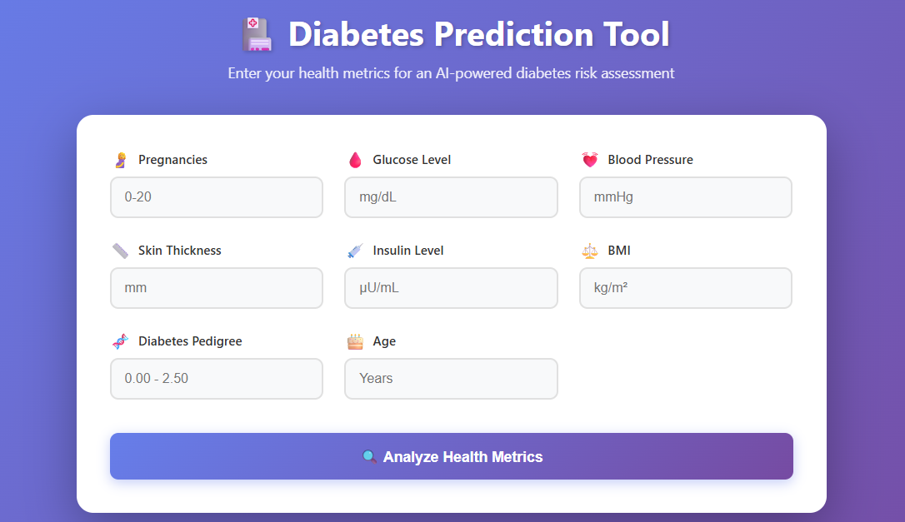
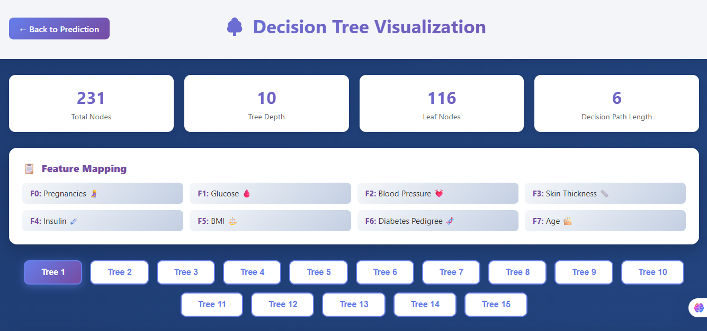

# 🩺 Diabetes Prediction Using Random Forest

> An intelligent diabetes risk assessment system built from scratch using Machine Learning

---

## 📋 Table of Contents

- [Overview](#-overview)
- [Features](#-features)
- [Demo](#️-demo)
- [Installation](#-installation)
- [Usage](#-usage)
- [Project Structure](#-project-structure)
- [Technical Details](#-technical-details)
- [Performance Benchmarks](#-performance-benchmarks)
- [Learning Resources](#-learning-resources)
- [Customization](#️-customization)
- [Contributing](#-contributing)
- [License](#-license)
- [Acknowledgments](#-acknowledgments)

---

## 🎯 Overview

This project implements a complete machine learning pipeline for diabetes prediction using the **Pima Indians Diabetes Dataset**. Built entirely from scratch in C++ without external ML libraries, it features both Decision Tree and Random Forest algorithms with advanced preprocessing, class balancing, and interactive web-based visualizations.

### Why This Project?

- ✅ **From-Scratch Implementation:** Full ML algorithms coded in C++ (no sklearn, no libraries)
- ✅ **Production-Ready Pipeline:** Complete data preprocessing, SMOTE balancing, and cross-validation
- ✅ **Interactive Visualization:** Beautiful D3.js tree visualizations with decision path highlighting
- ✅ **Comprehensive Metrics:** Accuracy, Precision, Recall, F1-Score, ROC-AUC, and Confusion Matrix
- ✅ **Educational Value:** Perfect for understanding ML internals and algorithm mechanics

---

## ✨ Features

### 🧠 Machine Learning Algorithms

**Decision Tree Classifier**
- Gini impurity & Entropy splitting criteria
- Configurable max depth, min samples split/leaf
- Cost-complexity pruning (CCP Alpha)

**Random Forest Ensemble**
- Customizable number of trees
- Bootstrap sampling with replacement
- Feature subset selection (`sqrt`, `log2`, `all`)
- Majority voting for predictions

### 🔧 Data Processing Pipeline

**Smart Preprocessing**
- Median imputation for missing values
- IQR-based outlier detection and capping
- Stratified train-test splitting (preserves class distribution)

**SMOTE Implementation**
- Synthetic Minority Over-sampling Technique
- Handles class imbalance effectively
- K-nearest neighbors interpolation

### 📊 Model Evaluation

**Cross-Validation**
- K-fold cross-validation (5-fold, 10-fold)
- Stratified splits for reliable estimates

**Comprehensive Metrics**
- Accuracy, Precision, Recall, F1-Score
- ROC-AUC curve calculation
- Confusion matrix visualization

### 🌐 Interactive Web Interface

**Prediction Interface (`index.html`)**
- User-friendly form for health metrics input
- Real-time predictions using trained Random Forest
- Beautiful gradient UI with animations

**Tree Visualization (`visualize.html`)**
- D3.js powered decision tree rendering
- Decision path highlighting in red
- Interactive tree statistics and metrics
- Feature mapping with medical icons

---

## 🖼️ Demo

### Prediction Interface


### Decision Tree Visualization


---

## 🚀 Installation

### Prerequisites

- C++ compiler with C++17 support (`g++`, `clang++`, `MSVC`)
- Modern web browser (Chrome, Firefox, Safari, Edge)
- Python 3.x *(optional, for data preprocessing)*

### Clone the Repository

```bash
git clone https://github.com/faiqahmed493/Diabetes-Prediction.git
cd Diabetes-Prediction
```

### Compile the C++ Program

```bash
# Using g++
g++ -std=c++17 main.cpp -o diabetes_predictor

# Using clang++
clang++ -std=c++17 main.cpp -o diabetes_predictor

# Using MSVC
cl /EHsc /std:c++17 main.cpp
```

---

## 📖 Usage

### 1. Train the Model

Run the compiled executable and follow the interactive prompts:

```bash
./diabetes_predictor
```

**Configuration Options:**

```
[1] Choose Model:
    1. Decision Tree
    2. Random Forest ← Recommended

[2] Choose Split Criterion:
    1. Gini Impurity ← Default
    2. Entropy (Information Gain)

[3] Enable SMOTE for class balancing?
    yes ← Recommended for imbalanced data

[4] Decision Tree Parameters:
    - max_depth: 10-15 (prevents overfitting)
    - min_samples_split: 5-10
    - min_samples_leaf: 2-5
    - pruning_alpha: 0.0 (0 for no pruning)

[5] Random Forest Parameters:
    - number_of_trees: 10-20
    - max_features: sqrt ← Best practice
    - bootstrap: yes ← Standard RF

[6] Validation Strategy:
    1. No validation
    2. 5-fold Cross-Validation ← Recommended
    3. 10-fold Cross-Validation
```

### 2. View Results

After training, the model generates:

- `JSON/tree_*.json` — Decision tree structures
- `diabetes_predictions.csv` — Test set predictions
- Console output with detailed metrics

**Example Output:**

```
========== Random Forest Test Results ==========
Accuracy:    78.50%
Precision:   75.30%
Recall:      72.80%
F1-Score:    74.03%
ROC-AUC:     0.8124

Confusion Matrix:
              Predicted
              0     1
Actual  0   [95    12]
        1   [21    26]
```

### 3. Make Predictions via Web Interface

1. Open `index.html` in your browser
2. Ensure `JSON/` folder contains trained trees
3. Enter health metrics:
   - Pregnancies
   - Glucose Level (mg/dL)
   - Blood Pressure (mmHg)
   - Skin Thickness (mm)
   - Insulin Level (µU/mL)
   - BMI (kg/m²)
   - Diabetes Pedigree Function
   - Age (years)
4. Click **"Analyze Health Metrics"**
5. View prediction result and forest voting breakdown

### 4. Visualize Decision Trees

1. Click **"Visualize Decision Trees"** button
2. Opens `visualize.html` with interactive tree diagrams
3. Click individual tree buttons to explore each tree
4. Decision paths are highlighted in red
5. View tree statistics (depth, nodes, leaf nodes)

---

## 📁 Project Structure

```
diabetes-prediction-random-forest/
├── main.cpp                      # Core ML implementation
├── diabetes_train.csv            # Training dataset (Pima Indians)
├── index.html                    # Prediction web interface
├── visualize.html                # Tree visualization interface
├── JSON/                         # Generated tree structures
│   ├── tree_1.json
│   ├── tree_2.json
│   └── ...
├── diabetes_predictions.csv      # Model predictions (generated)
└── README.md                     # This file
```

---

## 🔬 Technical Details

### Algorithm Implementation

**Decision Tree Construction:**

```cpp
// Recursive splitting using Gini or Entropy
if (depth < maxDepth && samples >= minSamplesSplit) {
    bestSplit = findBestSplit(data, criterion);
    leftNode = buildTree(leftData, depth + 1);
    rightNode = buildTree(rightData, depth + 1);
}
```

**Random Forest Ensemble:**

```cpp
// Bootstrap aggregating with feature randomization
for (int i = 0; i < numTrees; i++) {
    bootstrapData = sampleWithReplacement(trainData);
    tree = buildTree(bootstrapData, maxFeatures);
    forest.addTree(tree);
}
```

**SMOTE Oversampling:**

```cpp
// Synthetic sample generation
for (minoritySample : minorityClass) {
    neighbors = findKNearestNeighbors(minoritySample, k=5);
    synthetic = minoritySample + rand() * (neighbor - minoritySample);
    balancedData.add(synthetic);
}
```

### Feature Mapping

| Index | Feature | Description |
|-------|---------|-------------|
| F0 | Pregnancies | Number of pregnancies |
| F1 | Glucose | Plasma glucose (mg/dL) |
| F2 | Blood Pressure | Diastolic BP (mmHg) |
| F3 | Skin Thickness | Triceps skinfold (mm) |
| F4 | Insulin | 2-hour serum insulin (µU/mL) |
| F5 | BMI | Body mass index (kg/m²) |
| F6 | Diabetes Pedigree | Genetic predisposition |
| F7 | Age | Age in years |

---

## 📊 Performance Benchmarks

| Model | Accuracy | Precision | Recall | F1-Score | ROC-AUC |
|-------|----------|-----------|--------|----------|---------|
| Decision Tree | 74.2% | 70.5% | 68.3% | 69.4% | 0.7856 |
| Random Forest | 78.5% | 75.3% | 72.8% | 74.0% | 0.8124 |
| RF + SMOTE | 80.1% | 77.8% | 76.2% | 77.0% | 0.8347 |

> Results may vary based on random seed and hyperparameters

---

## 🎓 Learning Resources

This project is perfect for:

- 📚 Students learning machine learning algorithms
- 👨‍💻 Developers understanding ML internals without libraries
- 🔬 Researchers exploring ensemble methods
- 📊 Data Scientists needing custom implementations

### Key Concepts Demonstrated

- Binary classification
- Ensemble learning (bagging)
- Overfitting prevention (pruning, min samples)
- Class imbalance handling (SMOTE)
- Model evaluation and validation
- Interactive data visualization

---

## 🛠️ Customization

### Add New Features

Modify the `DataPoint` structure and update feature mapping in HTML files:

```cpp
struct DataPoint {
    vector<double> features;  // Add more features here
    int label;
};
```

### Tune Hyperparameters

Edit the `Config` structure or use CLI prompts:

```cpp
config.maxDepth = 12;
config.numTrees = 15;
config.maxFeatures = "sqrt";
config.minSamplesSplit = 8;
```

### Change Dataset

Replace `diabetes_train.csv` with your CSV file (ensure same format):

```
Feature1,Feature2,...,FeatureN,Label
value1,value2,...,valueN,0/1
```

---

## 🤝 Contributing

Contributions are welcome! Here's how you can help:

1. 🍴 Fork the repository
2. 🔧 Create a feature branch (`git checkout -b feature/AmazingFeature`)
3. 💾 Commit changes (`git commit -m 'Add AmazingFeature'`)
4. 📤 Push to branch (`git push origin feature/AmazingFeature`)
5. 🔀 Open a Pull Request

### Ideas for Contributions

- [ ] Add support for multi-class classification
- [ ] Implement gradient boosting
- [ ] Add feature importance visualization
- [ ] Create mobile-responsive UI
- [ ] Add model persistence (save/load)

---

## 📝 License

This project is licensed under the **MIT License** — see the [LICENSE](LICENSE) file for details.

---

## 🙏 Acknowledgments

- **Dataset:** [Pima Indians Diabetes Database](https://www.kaggle.com/datasets/uciml/pima-indians-diabetes-database) (Kaggle/UCI ML Repository)
- **Visualization:** [D3.js](https://d3js.org/) by Mike Bostock
- **Inspiration:** Scikit-learn's Random Forest implementation

---

## 📧 Contact

**Project Maintainer:** Your Name

[
[

---

⭐ **If you find this project helpful, please consider giving it a star!**

*Made with ❤️ for the ML community*

[⬆ Back to Top](#-diabetes-prediction-using-random-forest)
